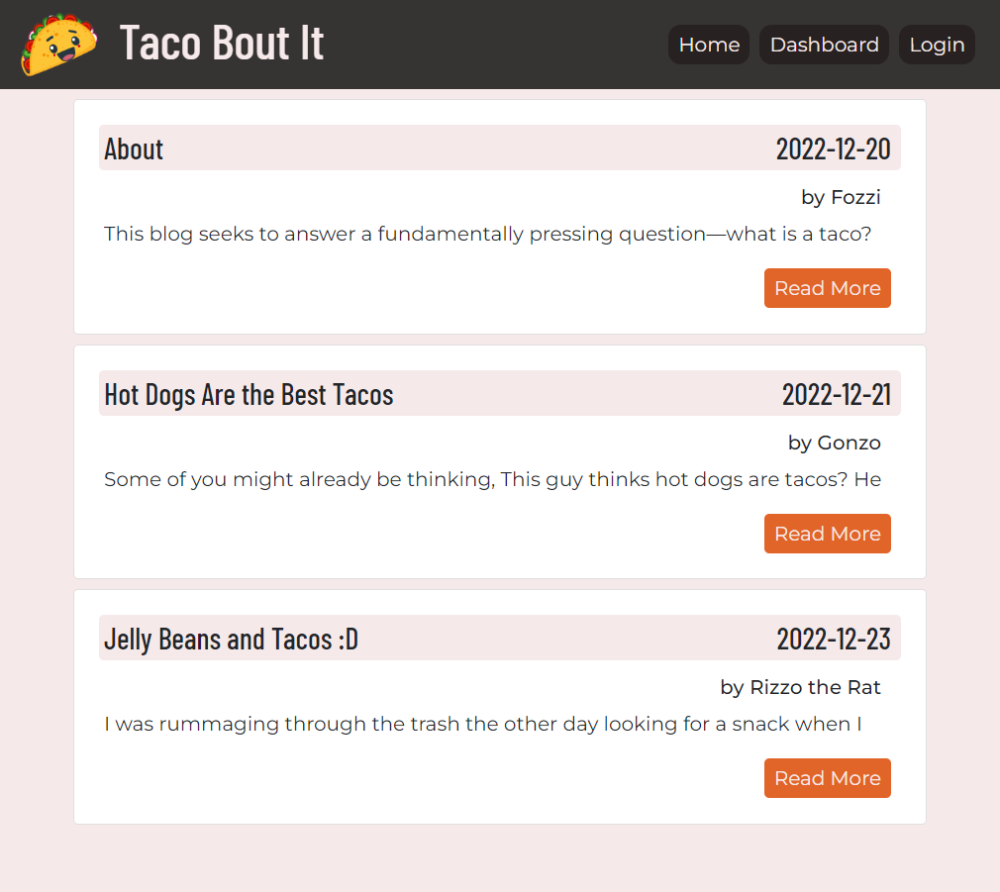
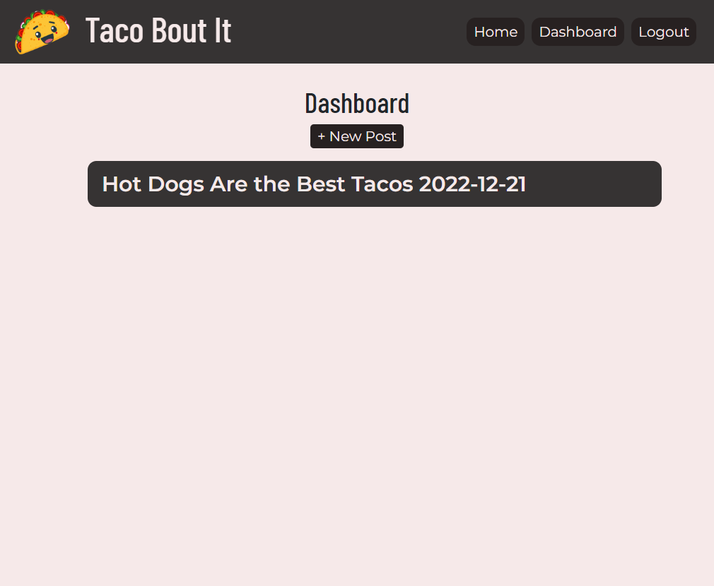
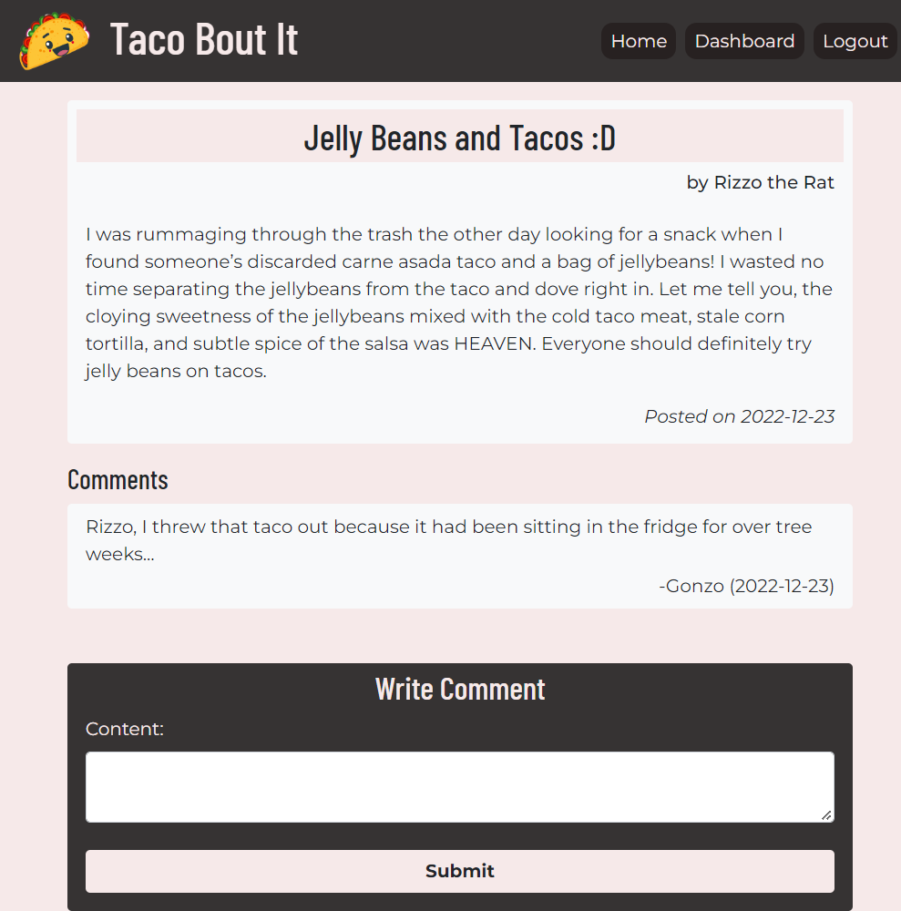
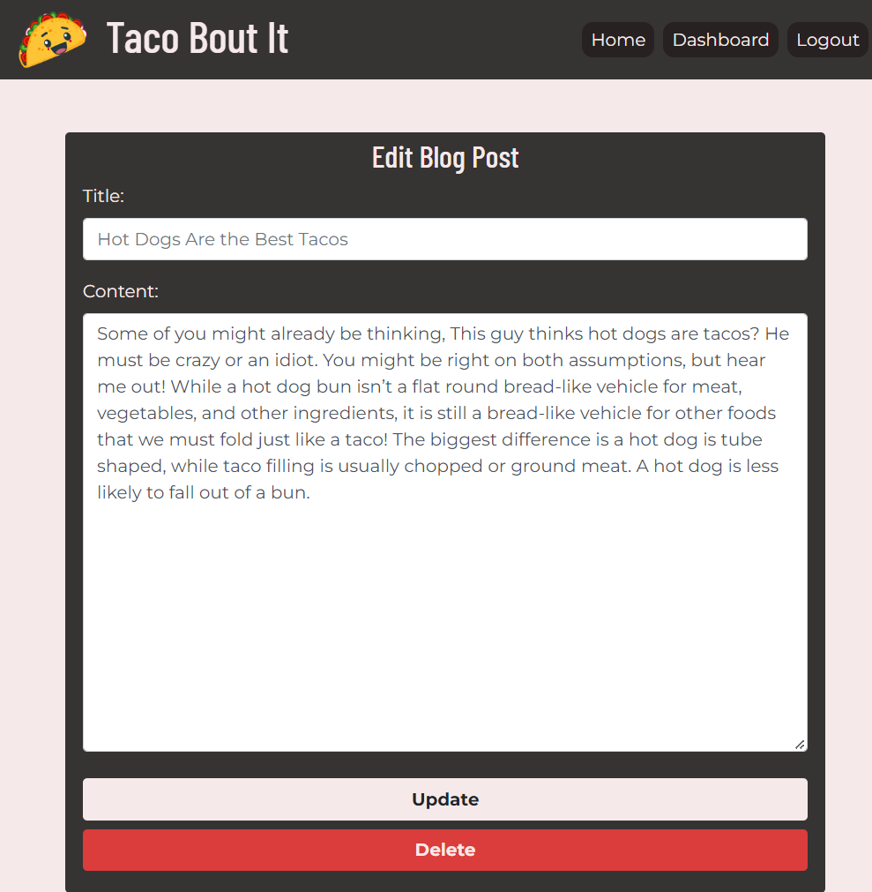

# Taco Bout It Blog


## Description
A lot of people on the internet love to share their opinions on different topics, and one way people can do that is through blogs. Taco Bout It is a blog on which people can share their thoughts about an extremely important topic—tacos. Users can discuss anything they want about tacos, including taco recipes, good taco restaurants, or even what they think qualifies as taco! While the topic of the blog is presented in good fun, what’s more is the way in which the blog was built. Taco Bout It is a full stack application built with [Node.js](https://nodejs.org/en/), [Handlebars](https://www.npmjs.com/package/express-handlebars), [Express](https://www.npmjs.com/package/express), [Sequelize](https://sequelize.org/), [mysql2](https://www.npmjs.com/package/mysql2), [Express Session](https://www.npmjs.com/package/express-session), and of course, JavaScript, HTML, and CSS. I used the [Bootstrap](https://getbootstrap.com/docs/4.5) framework and the application was deployed through [Heroku](https://www.heroku.com/). The taco mascot was AI generated with [DALL-E](https://openai.com/dall-e-2/).









### Deployed Application

[Taco Bout It](https://taco-bout-it-blog.herokuapp.com/)

## Table of Contents 

- [Installation](#installation)
- [Usage](#usage)
- [License](#license)
- [Contributing](#contributing)
- [Questions](#questions)

## Installation

To install the necessary dependencies after cloning the repo, run the following conmmand(s):
  
```
npm install
```

## Usage

If you want to use this application from your local machine instead of through Heroku, you will need to have [MySQL](https://coding-boot-camp.github.io/full-stack/mysql/mysql-installation-guide) installed on your system and run the `schema.sql` file prior to useage. In your MySQL CLI, run the following commands:

```
source db/schema.sql
```
To seed your database, run the following command in GitBash or your prefered CLI:

```
npm run seed
```
Create a `.env` file with DB_NAME set to 'tacoboutit_db' and DB_USER and DB_PASSWORD set to your information. 

When using the application on Heroku, you should probably avoid providing any sensitive information as this is only a personal project. 

## License

This project is licensed under the 	[MIT](https://github.com/ggorosave/Taco_Bout_It_Blog/blob/main/LICENSE) license.

## Contributing

If you are interested in contributing to this project or have some ideas about how to improve it, you may fork this repository and make your desired changes. When you have finished, send a pull request and I will review it when I have a chance.


## Questions

If you have any questions about the repo, contact me at [ggorosave@gmail.com](mailto:ggorosave@gmail.com). Find more of my work at [ggorosave](https://https://github.com/ggorosave).
